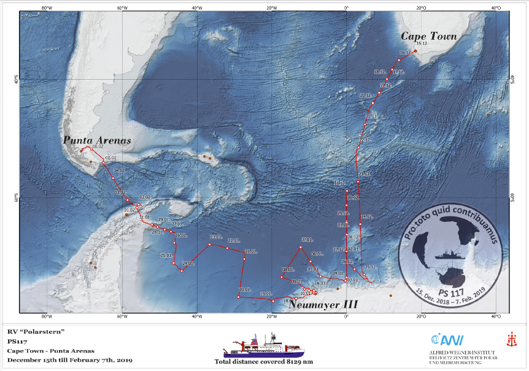

# PS117 

The PS117 expedition took place between the 15th of December 2018 and the 7th of February 2019. The German research vessel R.V. Polarstern departed from Cape Town, South Africa, going south along the zero meridian, across the Weddell Sea to Elephant Island, after which it ended the expedition in Punta Arenas, Chile. You can find the PS117 Expedition Report [here](https://www.tib.eu/en/search/id/awi%3Adoi~10.2312%252FBzPM_0732_2019/). 

## Data from / Samples Analysed by Others

In order to be able to process the raw DIC/TA data (see below), I need other information, such as the salinity and temperature of the water mass from which the sample was taken. I retrieved these data from the PANGAEA database. I used the calibrated [discrete bottle data](https://doi.pangaea.de/10.1594/PANGAEA.910673) for each of the relevant hydrological stations and casts. For transect analysis of e.g. temperature, salinity, and oxygen, I use the [continuous profile measurements](https://doi.pangaea.de/10.1594/PANGAEA.910663) from the same casts, as these have a much higher vertical resolution (about 1 dbar ~ 1 m). 

Note that the continuous profile measurements are from the _down cast_ while the discrete bottle data are measurements from the _up cast_, which is when the sampling (Niskin) bottles close). I reformatted the data files from PANGAEA to something that I found easier to work with in my scripts. You can find the script (Jupyter NoteBook) that I used for this purpose [here](PS117_ctd_comparisons_test.html). 

## DIC and TA Sample Collection

During this expedition, I took DIC/TA samples at various depths along the water column at most stations. In total, I collected samples at ... stations, resulting in a total of 861 samples. A replicate sample was taken at each station, at a depth where little variability (i.e. no vertical gradient) in the carbon system variables is expected. Samples were collected from Niskin bottles on the CTD rosette, following the SOP 1 protocol by [Dickson et al. (2007)](https://www.oceanbestpractices.net/handle/11329/249). Here, I'll give a short summary:

- Oxygen samples are the only samples that were taken prior to the DIC/TA samples (samples for gas measurements always need to be taken first)
- A Teflon tube was connected to the Niskin bottle. The Niskin bottle was opened and all bubbles in the Teflon tube were removed (soaking the tube in clean sea water 24 hours prior to sampling made this a lot easier!)
- The tube was put into a clean borosilicate glass bottle with glass stopper, reaching all the way to the bottom of the bottle, which was then filled (avoiding/removing any bubbles) and then over twice, keeping the third "overfill" and making sure the sea water reaches the brim before putting the glass stopper on. 
- Once all samples from the rosette were collected, they were taken to the lab
- 1% headspace was created with a Pasteur pipette (i.e. 2.5 mL was removed from a 250mL bottle)
- The sample was poisoned with mercuric chloride (HgCl2): 0.05mL of saturated HgCl2 solution was added to a 250mL bottle. 
- Stopper was greased with (Apiezon(R) L or M grease to form an airtight seal when put back into the bottle and twisting it to create a uniform layer. 
- Stopper was secured with two elastic bands and a cable tie
- Bottle was inverted several times to mix the sea water well with the HgCl2. 

All samples were stored in their original boxes, in a cool, dark location. All samples were numbered from 1 to 861. At no point were samples in a freezing or very hot (>35 degrees Celsius) environment. This could seriously affect the DIC/TA content. 

## DIC and TA: Analytical and Computational

Out of the 861 samples I collected, I analysed 767 of them on the VINDTA 3C at AWI, Bremerhaven, between 9 September and 9 December 2019. DIC/TA samples were analysed against Certified Reference Materials (CRMs). These are prepared at Scripps Institution of Oceanography (University of California, San Diego). CRMs are prepared in batches, which are numbered. Each CRM batch has a slightly different concentration of DIC, TA, salinity, and nutrients. Most of the PS117 samples were analysed against CRMs from batch 176, and a small fraction were analysed against CRMs from batch 185. The information on the certified concentrations of these CRM batches can be found [here](https://www.nodc.noaa.gov/ocads/oceans/Dickson_CRM/batches.html). 

### DIC 

### TA 

Link to [Calkulate](https://github.com/mvdh7/calkulate)

## Other Computations

Link to [PyCO2SYS](https://github.com/mvdh7/PyCO2SYS)

